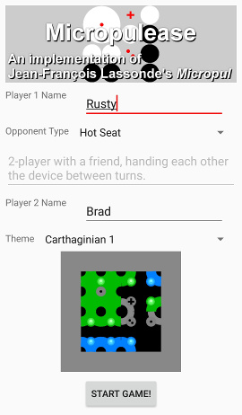
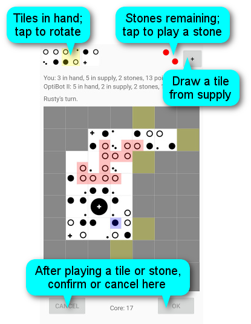
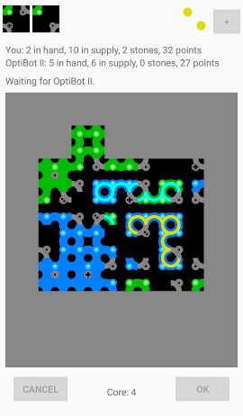
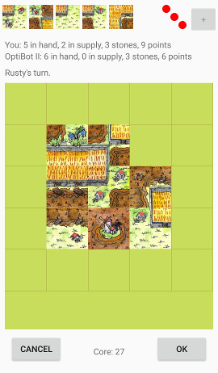
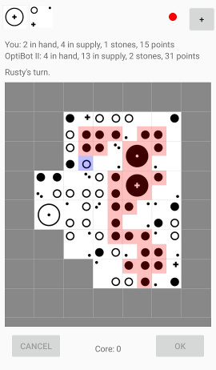

# Micropulease

[Micropul](https://boardgamegeek.com/boardgame/10660) for Android; play hot-seat or against a bot.

**The existing bots are really bad,** but it's intended to be easy to add your own bot; see [CONTRIBUTING](CONTRIBUTING.md).

Same goes for the renderers which draw the board & tiles.

For notes on checking this out & building it, see [CONTRIBUTING](CONTRIBUTING.md).

## Overview

Here's the surprisingly unattractive start-game screen, where you enter
your name, your opponent type (hot seat or one of the bots), and your
theme.

Here's an example during play, using the Classic renderer:

Here's a game using the Carthaginian 1 renderer; the groups with yellow
& cyan lines have been claimed.

Here's a game using the Archinerd's Stick/Mud Farmer 2 renderer.  (It
uses images taken from Archinerd's hand-painted tile set; the houses are
drawn on top of the tile background so that they're always upright when
the tile is rotated.  It's pretty fun, but it could be improved.)

Here's the end of a game using the Classic renderer; I got stomped by
OptiBot II, but was _one turn away_ from closing that big group &
winning.

